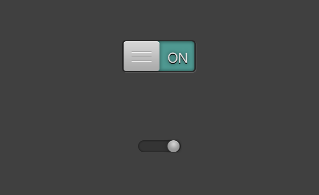

Overview
-
ABSwitch is a replacement for Apple's default UISwitch implementation.
It is highly customizable.

===

How To
-
See Example Project for default setup and how to use custom images.

Screenshot
-


===

===

Properties
-
```objective-c
/*
 Current selected Index (Either 0 or 1)
 */
@property (nonatomic, assign) NSInteger currentIndex;

/*
 Block that is called everytime index changes
 */
@property (nonatomic, assign) void (^block) (NSInteger currentIndex);

/*
 Delegate as alternative to using Blocks
 */
@property (nonatomic, strong) id <ABSwitchDelegate> delegate;

/*
 Text for both Indices
 */
@property (nonatomic, strong) NSString *leftText;
@property (nonatomic, strong) NSString *rightText;

/*
 Label Font
 */
@property (nonatomic, strong) UIFont *font;

/*
 If your background image uses rounded corners adjust this value to make the left/right color views fit with the background
 */
@property (nonatomic, assign) CGFloat cornerRadius;

/*
 Adjust vertical offset of switch image to make it fit with switch background
 */
@property (nonatomic, assign) CGFloat switchOffsetY;

/*
 Adjust horizontal offset of switch image to make it fit with the LEFT corner of the switch background
 */
@property (nonatomic, assign) CGFloat switchOffsetXLeft;

/*
 Adjust horizontal offset of switch image to make it fit with the RIGHT corner of the switch background
 */
@property (nonatomic, assign) CGFloat switchOffsetXRight;

/*
 Adjust inset of left / right Color View to make it fit into the switch background
 */
@property (nonatomic, assign) CGFloat colorViewInset;

/*
 Adjust
 */
@property (nonatomic, assign) CGPoint backgroundShadowOffset;

/*
 Set Colors for both Indices
 */
@property (nonatomic, strong) UIColor *leftColor;
@property (nonatomic, strong) UIColor *rightColor;

/*
 Show shadow below switch
 */
@property (nonatomic, assign) BOOL showShadow;
```

===

License
-
Copyright (c) 2012 (Ablfx) Alexander Blunck

Permission is hereby granted, free of charge, to any person obtaining a copy of this software and associated documentation files (the "Software"), to deal in the Software without restriction, including without limitation the rights to use, copy, modify, merge, publish, distribute, sublicense, and/or sell copies of the Software, and to permit persons to whom the Software is furnished to do so, subject to the following conditions:

The above copyright notice and this permission notice shall be included in all copies or substantial portions of the Software.

THE SOFTWARE IS PROVIDED "AS IS", WITHOUT WARRANTY OF ANY KIND, EXPRESS OR IMPLIED, INCLUDING BUT NOT LIMITED TO THE WARRANTIES OF MERCHANTABILITY, FITNESS FOR A PARTICULAR PURPOSE AND NONINFRINGEMENT. IN NO EVENT SHALL THE AUTHORS OR COPYRIGHT HOLDERS BE LIABLE FOR ANY CLAIM, DAMAGES OR OTHER LIABILITY, WHETHER IN AN ACTION OF CONTRACT, TORT OR OTHERWISE, ARISING FROM, OUT OF OR IN CONNECTION WITH THE SOFTWARE OR THE USE OR OTHER DEALINGS IN THE SOFTWARE.